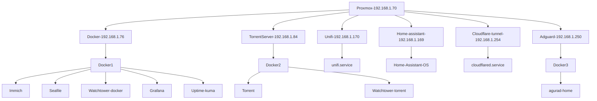
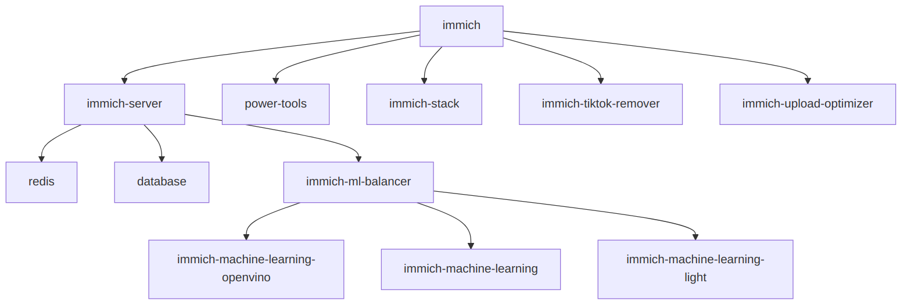
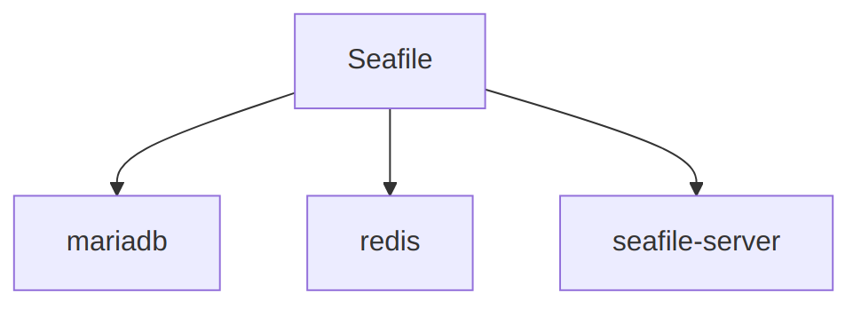
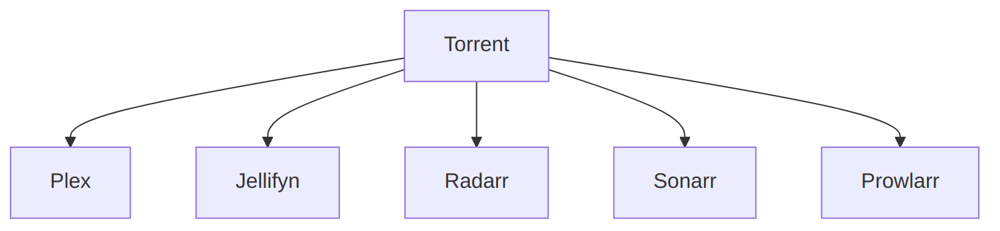
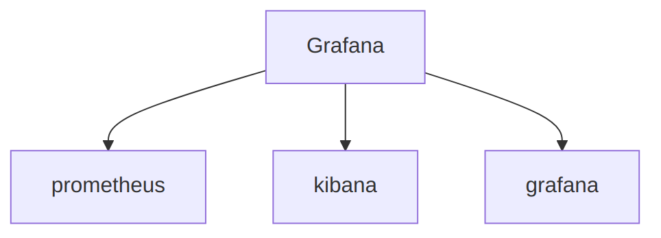

# Home Lab Infrastructure

This repository contains the configuration and deployment manifests for a multi-layered home lab environment. The infrastructure is managed through a combination of Docker Compose, Kubernetes (Minikube/Talos), and Terraform for Infrastructure as Code (IaC).

## Architecture Diagrams

### System Overview

### Core Services
#### Immich (Photo Management)

#### Seafile (File Storage)

#### Media & Torrenting

#### Monitoring (Grafana)

## Service Directory

The services are organized into functional categories to facilitate management and discovery.

### Core Infrastructure & Security
- **adguard**: DNS-level ad and tracker blocking.
- **authentik**: Centralized identity provider and authentication.
- **traefik**: Edge router and reverse proxy for service exposure.
- **portainer**: Web-based interface for container management.
- **watch-tower**: Automated updates for running Docker containers.
- **uptimekuma**: Uptime monitoring and status alerts.
- **clamAV**: Antivirus engine for scanning file uploads.
- **homepage**: Unified dashboard for service access.

### Data & Document Management
- **seafile**: High-performance file synchronization and storage.
- **paperless**: AI-powered document management and archiving.
- **bookmark**: Self-hosted bookmarking service.
- **gyurus-docs**: Internal documentation and knowledge sharing.

### Media & Entertainment
- **immich**: Self-hosted photo and video management solution.
- **torrent**: Stack for managing media downloads and distribution.
- **mc-server**: Dedicated Minecraft server instance.
- **hardver**: Automated monitoring for hardware marketplaces.

### AI & Productivity
- **liteLLM**: Unified proxy for various Large Language Model APIs.
- **openWebUI**: Interactive interface for local and remote LLMs.
- **affine**: Unified workspace for notes, tasks, and knowledge management.
- **vsc**: Code-server for browser-based development.

### Network & Utilities
- **searxng**: Privacy-focused metasearch engine.
- **mail-drop**: Local mail relay or temporary mail service.
- **napelem**: Monitoring system for solar energy production and consumption.

## Infrastructure as Code (Terraform)

The `terraform/` directory contains modules for provisioning virtual machines and managed services on Proxmox and Cloudflare.

- **adguard**: Provisioning of AdGuard Home instances.
- **cloudflare**: Management of Cloudflare Tunnels and DNS records.
- **docker**: Provisioning of dedicated Docker hosts.
- **ollama**: Infrastructure for hosting local AI models.
- **talos-kube**: Kubernetes cluster deployment using Talos Linux.
- **torrent**: Virtual machine setup for dedicated torrenting services.

## Deployment Strategy

Most services are deployed using Docker Compose for simplicity and portability. For more complex workloads, Kubernetes manifests are provided:

- **Docker Compose**: Each service directory contains a `docker-compose.yaml`. Configuration is managed via `.env` files (see `.env.template` for required variables).
- **Kubernetes**: Deployment and Ingress manifests for `immich` and `homepage` are located in their respective directories and the `minikube/` folder.
- **Terraform**: Infrastructure can be provisioned by running `terraform init` and `terraform apply` within the specific subdirectories under `terraform/`.

## Security Notes

- All sensitive credentials should be stored in `.env` files or passed as environment variables.
- The `.gitignore` file is configured to prevent accidental commits of `.env`, `.tfstate`, and other sensitive configuration files.
- Default passwords (e.g., in `paperless` or `napelem`) should be updated to secure values in production environments.
